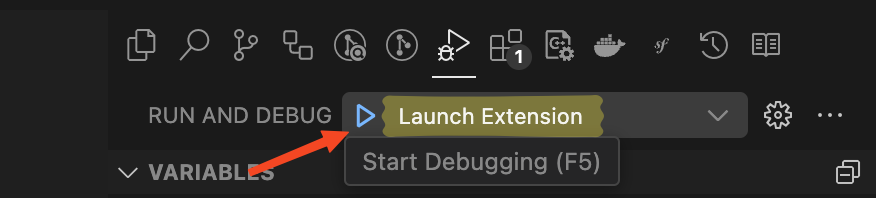
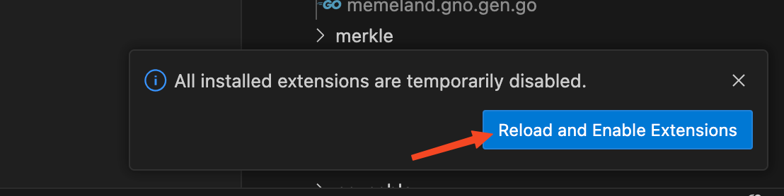

# Gno for Visual Studio Code

The VS Code Gno extension provides rich language support for the [Gno Programming Language](https://github.com/gnolang/gno)

## Requirements

* Visual Studio Code 1.75 or newer
* Go 1.21 or newer
* Gno

## Quick Start

Whether you are new to Gno or an experienced Gno developer, we hope this extension fits your needs and enhances your development experience.

1. Install [Go](https://go.dev/) 1.21 or newer and [Gno](https://docs.gno.land/getting-started/local-setup/installation) if you haven't already.
2. Clone the repository, run npm ci, and open VS Code:
    ```sh
    git clone https://github.com/gnoverse/vscode-gno
    cd vscode-gno/extension
    npm ci
    cd ..
    code .
    ```
3. To run the extension, open the Run view (Ctrl+Shift+D or ⌘+⇧+D), select Launch Extension, and click the Play button (F5).
<div style="text-align: center;"> </div>

This will open a new VS Code window with the title [Extension Development Host].You can then open a folder that contains Gno code and try.

<div style="text-align: center;"> </div>

4. The extension depends on gno, gnopls [the Gno language server](https://github.com/gnoverse/gnopls). If gnopls is missing, the extension will try to install it.

You are ready to Gno :-)    🎉🎉🎉

## Old Version VS New Version

Table showing the new features of this plugin compared with the old version.

| vscode-gno | Old Version | New version |
| ---------- | ----------- | ----------- |
| Highliting |     ✅      |      ✅     |
| Formating  |     ✅|  ✅|
| Intellisense |   ✅ | ✅ |
| Transpile |      ✅ |✅|
| Clean | ✅ |✅|
| Test Package | ✅ |✅|
| Test File |✅|✅|
| Test Function | ✅ |✅|
| Test At Cursor | ❌ |✅|
| Test All Packages In Workspace | ❌ |✅|
| Mod Init |✅ |✅|
| Maketx | ✅ |✅|
| Find References | ❌ |✅|
| Find Implementations | ❌ |✅|
| Go To Symbol | ❌ |✅|
| Call Hierarchy | ❌ |✅|
| Toggle Between Code And Tests | ❌ |✅|
| Add Import | ❌ |✅|
| Rename Symbol | ❌ |✅|
| Refactor | ❌ |✅|
| Auto Install Missing Tools | ❌ |✅|
| Lint | ❌ |⏳|


## Issues and Feedback

If you encounter any issues or have suggestions for improvements:

- Open an issue on the [GitHub repository](https://github.com/gnoverse/vscode-gno).
- Join the [gnolang](https://github.com/gnolang) community for discussions.

# License 

[MIT](https://github.com/golang/vscode-go/blob/master/LICENSE)