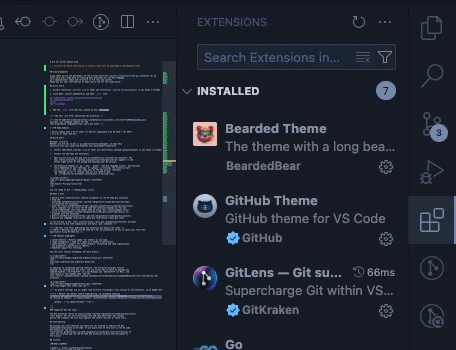
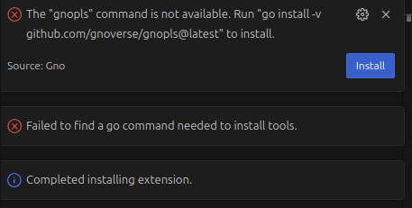
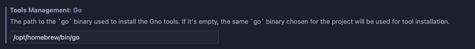
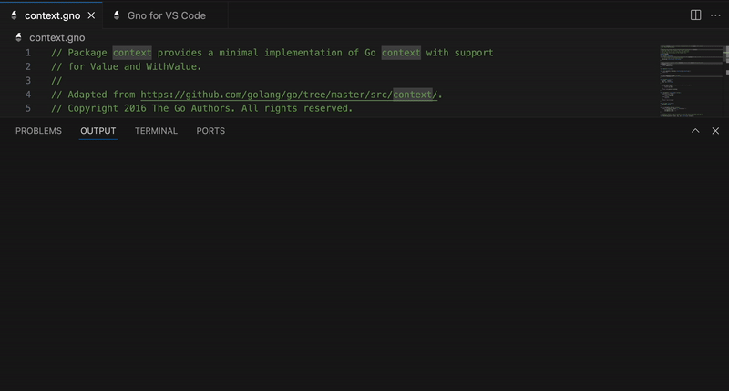
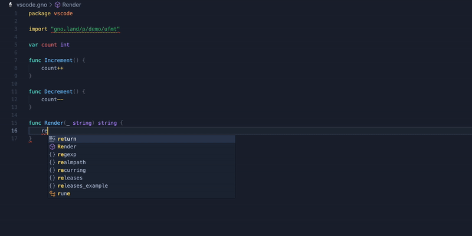
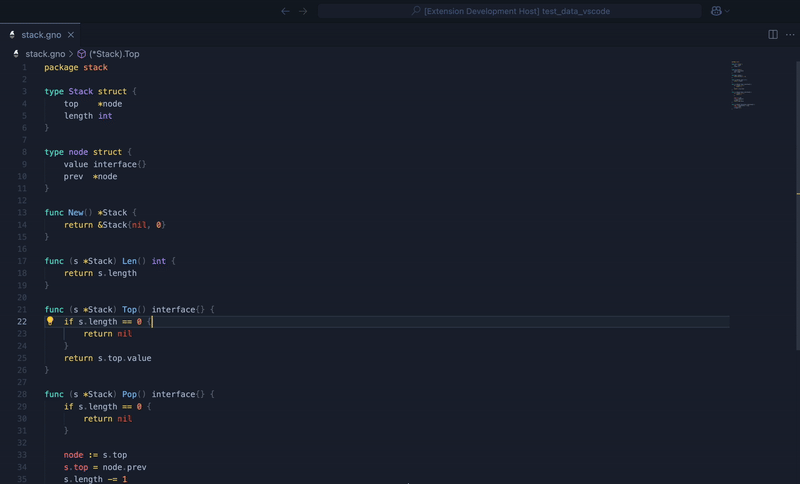

# Gno for Visual Studio Code

*⚠️ Currently we build from source to install, this will be published on marketplace soon*


## Acknowledgments

A big thank you to the developers of the [vscode-go](https://github.com/golang/vscode-go) extension for Go. 
Their work was a huge help in creating this extension for the Gno language, 
as I adapted their ideas and structure to fit this new context. 
Thank you for your contribution to open source and for the inspiration!

## Quick Start

1. Install [Go](https://go.dev) 1.21 or newer and [Gno](https://github.com/gnolang/gno) if you haven't already.

2. Clone Repo, install dependencies and make `.vsix` file

```
git clone https://github.com/gnoverse/vscode-gno.git
cd vscode-gno/extension
npm ci
npm run package
```

3. Add the `.vsix` file that was created to your extensions
<p align="center">

<br/>
</p>

4. Open any gno file or gno.mod file to automatically activate the extension.

## Automatic installation of gnopls

For the extension to work properly, it needs the [gnopls](https://github.com/gnoverse/gnopls) LSP server. 
If [gnopls](https://github.com/gnoverse/gnopls) is not installed, installation is automatic.

If you get this error message
<p align="left">

<br/>
</p>


This means that the extension cannot find the `go` binary needed to install `gnopls`. 
You'll need to add the PATH to your `go` binary in the extension settings.
<p align="left">

<br/>
</p>

You are ready to Gno :-) &nbsp;&nbsp; 🎉🎉🎉


<!-- add this line after publishing the extension -->

<!--[The VS Code Gno extension](https://marketplace.visualstudio.com/items?itemName=gnolang.gno)
provides rich language support for the
[Gno programming language](https://docs.gno.land).-->

<!--## Requirements

* Visual Studio Code 1.75 or newer (or editors compatible with VS Code 1.75+ APIs)
* Go 1.21 or newer and Gno.

## Quick Start

Welcome! 👋🏻<br/>
Whether you are new to Gno or an experienced Gno developer, we hope this
extension fits your needs and enhances your development experience.

1.  Install [Go](https://go.dev) 1.21 or newer and [Gno](https://github.com/gnolang/gno) if you haven't already.

1.  Install the [VS Code Gno extension].

1.  Open any Gno file or gno.mod file to automatically activate the extension. The
    [Gno status bar](https://github.com/gnoverse/vscode-gno/wiki/ui) appears in the
    bottom right corner of the window and displays your Go version.

1.  The extension depends on `go`, `gno`, `gnopls` (the Gno language server), and optional
    tools depending on your settings. If `gnopls` is missing, the extension will
    try to install it. The :zap: sign next to the Gno version indicates
    the language server is running, and you are ready to gno.
    `go` is required for automatic installation of missing tools.

<p align="center">

<br/>
<em>(Install Missing Tools)</em>
</p>

You are ready to Gno :-) &nbsp;&nbsp; 🎉🎉🎉

## What's next

* Explore more [features][full feature breakdown] of the VS Code Gno extension.
* View the
  [settings documentation](https://github.com/gnoverse/vscode-gno/wiki/settings)
	to customize the extension.
* View the [tools documentation](https://github.com/gnoverse/vscode-gno/wiki/tools)
  for a complete list of tools the VS Code Gno extension depends on. You can
  install additional tools and update them by using "Gno: Install/Update Tools".
* [file an issue](https://github.com/gnoverse/vscode-gno/issues/new/choose) for
  problems with the extension.
* Start a [GitHub discussion](https://github.com/gnoverse/vscode-gno/discussions).
* Explore Gno language resources on [docs.gno.land](https://docs.gno.land).

If you are new to Gno, [this article](https://docs.gno.land/getting-started/) provides
the overview on Gno code organization and basic `gno` commands.-->

<!-- add this line after publishing the extension and making the video -->
<!--Watch ["Getting started with VS Code Go"] for an explanation of how to build your first Gno
application using VS Code Gno.-->

<!--## Feature highlights

* [IntelliSense] - Results appear for symbols as you type.
* [Code navigation] - Jump to or peek at a symbol's declaration.
* [Code editing] - Support for saved snippets, formatting and code organization,
  and automatic organization of imports.
* Enhanced support for [testing]

See the [full feature breakdown] for more details.

<p align=center>

<br/>
<em>(Code completion and Signature Help)</em>
</p>

In addition to integrated editing features, the extension provides several
commands for working with Gno files. You can access any of these by opening the
Command Palette (`Ctrl+Shift+P` on Linux/Windows and `Cmd+Shift+P` on Mac), and
then typing in the command name. See the
[full list of commands](https://github.com/gnoverse/vscode-gno/wiki/commands#detailed-list) provided by this
extension.

<p align=center>

<br/><em>(Toggle Test File)</em></p>-->

<!-- As gnopls settings are no longer read directly from gnopls, this section is not necessary. To be added later -->

<!--**⚠️ Note**: For better syntax highlighting, we recommend enabling
[semantic highlighting](https://code.visualstudio.com/api/language-extensions/semantic-highlight-guide)
by turning on [Gnopls' `ui.semanticTokens` setting](https://github.com/gnoverse/vscode-gno/wiki/settings#uisemantictokens).
    ```
    "gnopls": { "ui.semanticTokens": true }
    ```
-->
<!--
### Supported Gno and tools

The Gno extension relies on [tools](https://github.com/gnoverse/vscode-gno/wiki/tools)
like `gnopls` for its core functionalities and they have their own release
policy and schedule. We test only against the latest versions of these tools.

## Contributing

We welcome your contributions and thank you for working to improve the Gno
development experience in VS Code. If you would like to help work on the VS Code
Gno extension, see our
[contribution guide](https://github.com/gnoverse/vscode-gno/wiki/contributing) to
learn how to build and run the VS Code Gno extension locally and contribute to
the project.

## License

[APACHE](LICENSE)

[`gnopls`]: https://github/gnoverse/gnopls
[`go`]: https://golang.org/cmd/go
[`gno`]: https://docs.gno.land/gno-tooling/cli/gno-tooling-gno-->
<!--[Managing extensions in VS Code]: https://code.visualstudio.com/docs/editor/extension-gallery-->
<!--[VS Code Go extension]: https://marketplace.visualstudio.com/items?itemName=gnolang.gno-->
<!--[Gno installation guide]: https://docs.gno.land/getting-started/local-setup/installation-->
<!-- Add this line after publishing video  -->
<!-- ["Getting started with VS Code Go"]: -->
<!--[IntelliSense]: https://github.com/gnoverse/vscode-gno/wiki/features#intellisense
[Code navigation]: https://github.com/gnoverse/vscode-gno/wiki/features#code-navigation
[Code editing]: https://github.com/gnoverse/vscode-gno/wiki/features#code-editing
[testing]: https://github.com/gnoverse/vscode-gno/wiki/features#run-and-test-in-the-editor
[full feature breakdown]: https://github.com/gnoverse/vscode-gno/wiki/features
[`Gno: Install/Update Tools` command]: https://github.com/gnoverse/vscode-gno/wiki/commands#gno-installupdate-tools-->