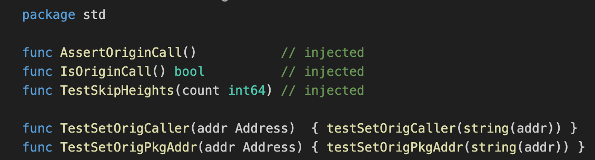
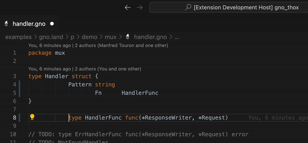
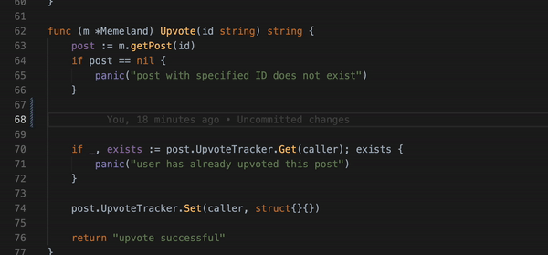
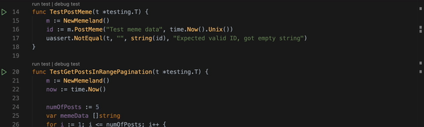
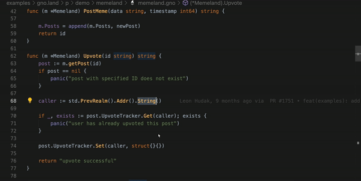
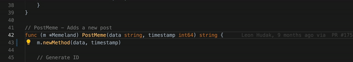

# Features

This document describes the features supported by this extension.

## Table of Contents

- [Highlighting](#highlighting)
- [Formatting](#formatting)
- [IntelliSense](#intellisense)
- [Gno Test](#gno-test)
    * [Test Package](#test-package)
    * [Test File](#test-file)
    * [Test Function](#test-function)
    * [Test At Cursor](#test-at-cursor)
- [Debugging](#debugging)
- [Add Package](#add-package)
- [Mod Init](#mod-init)
- [Find References](#find-references)
- [Find Implementations](#find-implementations)
- [Code Navigation](#code-navigation)
    * [Go to definition](#go-to-definition)
- [Call Hierarchy](#call-hierarchy)
- [Toggle Between Code and Tests](#toggle-between-code-and-tests)
- [Add Import](#add-import)
- [Rename Symbol](#rename-symbol)
- [Refactor](#refactor)

## Highlighting

The default syntax highlighting for gno files is implemented in Visual Studio Code using TextMate grammar, not by this extension.

<div style="text-align: center;"> </div>

## Formatting

Format code and organize imports, either manually or on save.

The extension formats `gno` code, organizes imports, and removes unused imports by default.
- **Organizing imports**
When organizing imports, the imported packages are grouped in the `goimports` style.

<div style="text-align: center;"> </div>

## IntelliSense   

- **Code completion**: Suggestions appear as you type.
- **Signature help**: Displays function parameters as you type.
- **Quick info**: Shows documentation when hovering over symbols.

<div style="text-align: center;"> </div>

## Gno Test

### Test Package

Runs all unit tests in a specified Gno package to verify the functionality of the entire module.

### Test File

Executes all tests within a specific `gno` test file.

### Test Function

Test a specific function

<div style="text-align: center;"> </div>

### Test At Cursor

Executes the test case where the cursor is currently placed in the code editor.

## Debugging

Debug a Gno package with breakpoints, stepping, the call stack, local variables, and expression evaluation (watch, hover, debug console). The extension drives the interactive debugger of `gno run -debug-addr`.

Press `F5` in a `.gno` file to debug its package, or add a `gno` configuration to `launch.json`:

```json
{
  "type": "gno",
  "request": "launch",
  "name": "Debug Gno package",
  "program": "${fileDirname}",
  "expr": "Render(\"\")"
}
```

`program` is a file or package directory passed to `gno run`. `expr` is optional and defaults to `main()`.

Limitations of the underlying debugger:
- Breakpoints work in the debugged program and in imported packages of GNOROOT (stdlibs and examples). Other imported packages are not supported.
- The debugger never stops at some statements, such as assignments of constants. Put the breakpoint on a nearby line.
- Breakpoints changed while the program runs take effect at the next stop. There is no pause.
- Expressions are limited to identifiers, selectors, indexes and literals (no calls or operators).
- Locals are found from the source of the current function and values cannot be expanded.

## Add Package

Publish Gno package/realm to the chain. The transaction is sent to the network selected with `gno.network`. `gnokey` needs to be installed for this feature to work.

## Mod Init

Create a `gnomod.toml` file.

## Find References

Find or go to the references of a symbol.

## Find Implementations

Find the concrete types that implement a given interface.

<div style="text-align: center;"> </div>


## [Code Navigation](https://code.visualstudio.com/docs/editor/editingevolved)

### Go to definition

Jump to or peek a symbol's declaration.


## Call Hierarchy

Show all calls from or to a function.

<div style="text-align: center;"> </div>

## Toggle Between Code And Tests

Quickly toggle between a file and its corresponding test file by using the [`Gno: Toggle Test File`](commands.md#gno-toggle-test-file) command.

<div style="text-align: center;"> </div>

## Add Import

The extension organizes imports automatically and can add missing imports.


## [Rename Symbol](https://code.visualstudio.com/docs/editor/refactoring#_rename-symbol)

Rename all occurrences of a symbol in your workspace.

Requires the [`gnopls`](https://github.com/gnoverse/gnopls) language server (`gno.useLanguageServer`).

<div style="text-align: center;"> </div>


## Refactor

Select the area for refactoring (e.g. variable, function body, etc). Click on the Code Action light bulb icon
that appears in the selected area, or select "Refactoring..." or "Rename Symbol" from the VS Code Context menu.
<div style="text-align: center;"> </div>

