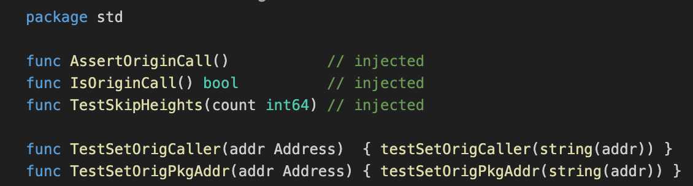
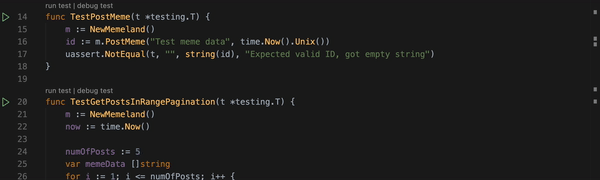
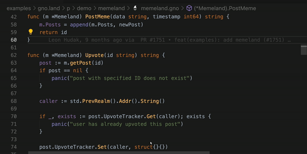
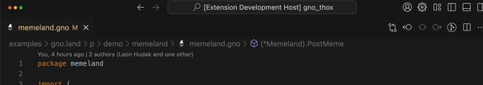
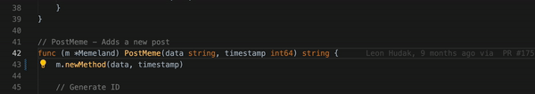

# Features

This document describes the features supported by this extension.

## Table of Contents

- [Highlighting](#highlighting)
- [Formatting](#formatting)
- [IntelliSense](#intellisense)
- [Transpile](#transpile)
- [Clean](#clean)
- [Gno:Test](#gno-test)
    * [Test File](#test-file)
    * [Test Function](#test-function)
    * [Test At Cursor](#test-at-cursor)
    * [Test All Packages In Workspace](#test-all-packages-in-workspace)
- [Mod Init](#mod-init)
- [Maketx](#maketx)
- [Find References](#find-references)
- [Find Implementations](#find-implementations)
- [Go To Symbol](#go-to-symbol)
- [Call Hierarchy](#call-hierarchy)
- [Toggle Between Code and Tests](#toggle-between-code-and-tests)
- [Add Import](#add-import)
- [Rename Symbol](#rename-symbol)
- [Refactor](#refactor)
- [Auto Install Missing Tools](#auto-install-missing-tools)
- [Lint](#lint)

## Highlighting

The default syntax highlighting for gno files is implemented in Visual Studio Code using TextMate grammar, not by this extension.

 

## Formatting

Format code and organize imports, either manually or on save.

The extension formats `gno` code, organizes imports, and removes unused imports by default. For different behavior.
- **Organizing imports**
When organizing imports, the imported packages are grouped in the default `gnoimports` style.

 

## IntelliSense   

- **Code completion**: Suggestions appear as you type.
- **Signature help**: Displays function parameters as you type.
- **Quick info**: Shows documentation when hovering over symbols.

 

## Transpile

Supports compiling or transpiling Gno code into executable formats, enabling easier deployment or testing.

## Clean

Removes unnecessary or temporary files generated during development. This helps to maintain a tidy workspace.

## Gno Test

### Test Package

Runs all unit tests in a specified Gno package to verify the functionality of the entire module.

### Test File

Executes all tests within a specific `gno` test 

#### Test Function 

Test a specific function

 

#### Test At Cursor 

Executes the test case where the cursor is currently placed in the code editor.

## Maketx

Publish Gno package/realm to the chain. `gnokey` needs to be installed for this feature to work.

## Mod init 

Create `gno.mod` file

## Find References

Find or go to the references of a symbol.

## Find Implementations

Find the concrete types that implement a given interface.

 

## [Code Navigation](https://code.visualstudio.com/docs/editor/editingevolved)

### Go to definition

Jump to or peek a symbol's declaration.

## Call Hierarchy

Show all calls from or to a function.

 

## Toggle Between Code And Tests

Quickly toggle between a file and its corresponding test file by using the [`Gno: Toggle Test File`](commands.md#go-toggle-test-file) command.

 

## Add Import

The extension organizes imports automatically and can add missing imports if the package is present in your module cache already. 

### [Rename symbol](https://code.visualstudio.com/docs/editor/refactoring#_rename-symbol)

Rename all occurrences of a symbol in your workspace.

**Note**: For undo after rename to work on Windows, you need to have `diff` tool on your `PATH`.

This feature is not available if you are using  **without** [`gnopls`](https://github.com/gnoverse/gnopls), the Go language server.

 

## Refactor

Select the area for refactoring (e.g. variable, function body, etc). Click on the Code Action light bulb icon
that appears in the selected area, or select "Refactoring..." or "Rename Symbol" from the VS Code Context menu.

 

